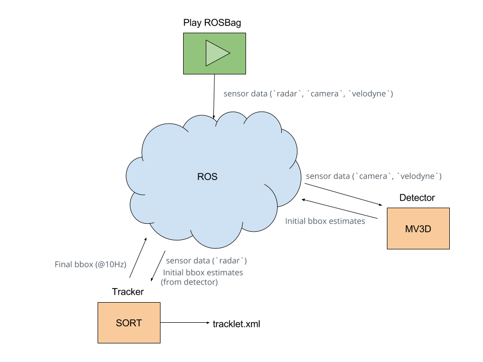

# Purpose
This document describes the final submitted codes for team **"In It To Win It"** for the [Udacity Self-Driving Car Challenge 2017](https://challenge.udacity.com/).

# System Settings and Dependencies
* Ubuntu 14.04
* ROS Indigo
* ros-indigo-velodyne
* [TO-ADD]

# Background and Overview
Our ROS implementation consists of two nodes:
* detector
* tracker
saved as two ROS packages with the same names.



## Detector Node
The detector node implements our main detection algorithm based on the [Multi-View 3D Object Detection Network for Autonomous Driving](https://arxiv.org/abs/1611.07759) algorithm, using a tuned model with a set of pre-trained weights (see below). This algorithm uses the Lidar top-view, front-view, and the camera images to detect the first estimation of the bounding boxes.

## Tracker Node
The tracker node implements Kalman filter to track the target obstacles. It uses the [SORT](https://github.com/mandarup/multi-object-tracking) algorithm for multi-object tracking to remove false positives. In addition, it also implements Kalman-based sensor fusion to include mesurement updates from radar messages. Furthermore, this node is responsible for producing a detection output in a timeframe required by the competition (10Hz), irrespective of the sensors' measurement frequencies and MV3D detection processing time. 

# Training of MV3D Network
To obtain the set of weights, first train the MV3D network as follows:

```[TO-ADD]```

# Setup

* Copy the entire `src` folder to your catkin workspace. For example,
```
cp -r src ~/catkin_ws/
cd ~/catkin_ws/
```

* Note: Make sure the following files are executable (use `chmod +x`):
..* `~/catkin_ws/src/detector/scripts/predict_rpc.py`
..* `~/catkin_ws/src/detector/scripts/pipeline.py`
..* `~/catkin_ws/src/tracker/scripts/tracker.py`

* Build the catkin package
```
catkin_make
source ~/catkin_ws/devel/setup.bash
``` 

# To Run

## 1. Download the neural net weights, and put it under the right directory:

A. Download the model weights here: 

B. Put the zip file under ros/src/detector/MV3D/checkpoint directory

C. After unzip the zipped file, it will show 2 directories: `car` and `ped`. And its structure will be like the 
following: 
```
checkpoint/
├── car
│   ├── fusion
│   │   ├── checkpoint
│   │   ├── fusion.data-00000-of-00001
│   │   ├── fusion.index
│   │   └── fusion.meta
│   ├── image_feature
│   │   ├── checkpoint
│   │   ├── image_feature.data-00000-of-00001
│   │   ├── image_feature.index
│   │   └── image_feature.meta
│   └── top_view_rpn
│       ├── checkpoint
│       ├── top_view_rpn.data-00000-of-00001
│       ├── top_view_rpn.index
│       └── top_view_rpn.meta
└── ped
    ├── fusion
    │   ├── checkpoint
    │   ├── fusion.data-00000-of-00001
    │   ├── fusion.index
    │   └── fusion.meta
    ├── image_feature
    │   ├── checkpoint
    │   ├── image_feature.data-00000-of-00001
    │   ├── image_feature.index
    │   └── image_feature.meta
    └── top_view_rpn
        ├── checkpoint
        ├── top_view_rpn.data-00000-of-00001
        ├── top_view_rpn.index
        └── top_view_rpn.meta

8 directories, 24 files

```


 
## 1. Run detector node: 
### A. for pedestrian obstacle
 
run ROS launch file for pedestrian
 
```
roslaunch launch/[TO-ADD]
```

### B. for car obstacle

run ROS launch file for cars
 
```
roslaunch launch/[TO-ADD]
```

## 2. Then run tracker node:

```rosrun tracker tracker.py```

## 3. Then playback the rosbag file with velodyne reader: 

```
roslaunch velodyne_pointcloud 32e_points.launch
rosbag play [ROSBAG] -l
```

# Output
The final bounding box output will be published by the `tracker` node in the form of `PoseArray` message for obstacle position and orientation.

Once one loop of the rosbag playback has completed (frame index restarts from beginning), a tracklet file will be generated and saved in the same folder.

 
---


