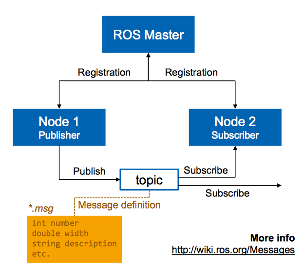
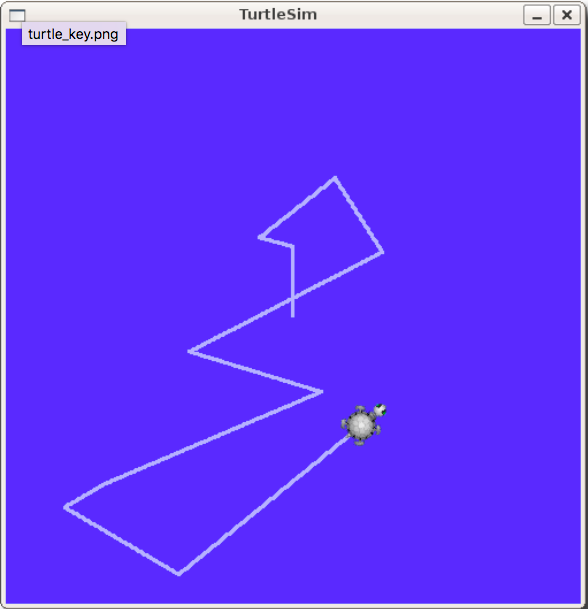
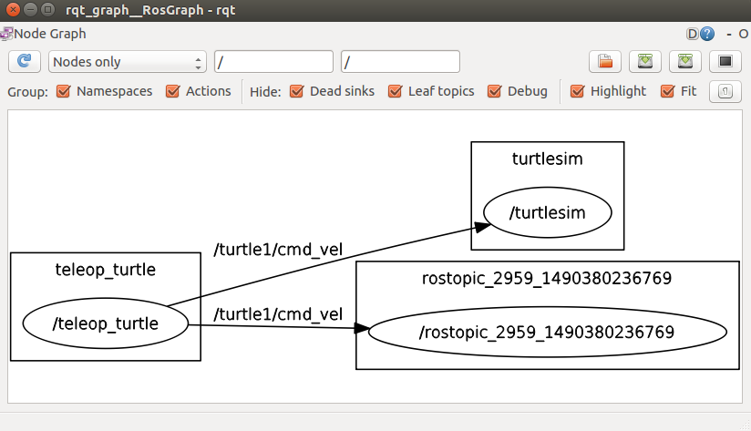
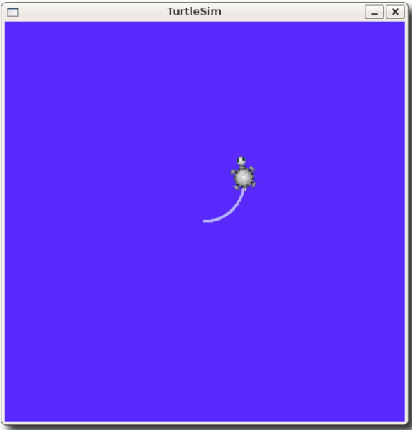
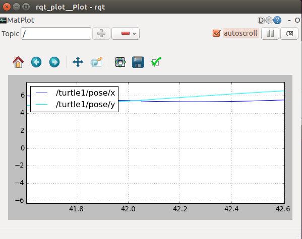

# ROS Overview




# Navigating the ROS Filesystem
**Explain what is ROS package and manifests,how to find package(rospack find), change directory to a package location (roscd),and list package directory contents (rosls).**

**Packages**: software organization unit of ROS code. Each package can contain libraries, executables, scripts or other artifacts.

**Manifests (package.xml)**: A manifest is a description of a package. It serves to define dependencies between packages and to capture meta information about the package like version, maintainer, license, etc...

## Find package (rospack find)
$ rospack find [package_name]
```
$ rospack find roscpp
/opt/ros/indigo/share/roscpp
```

## Change directory to a package location (roscd)
$ roscd [locationame[/subdir]]
```
$ roscd roscpp
/opt/ros/indigo/share/roscpp$
```

## List package directory contents (rosls)
$ rosls
```
/opt/ros/indigo/share/roscpp$ rosls
cmake  msg  package.xml  rosbuild  srv
```

# Creating and building a ROS package
**Use Catkin, a low-level build system macros and infrastructure for ROS, to create and build ROS package.**

Catkin package requirement :
* package.xml (it must be catkin compliant, will be discussed later...)
* CMakeLists.txt
* No more than one package in each folder

For example, a simplest catkin package may look like
```
my_package/
  CMakeLists.txt
  package.xml
```

First, we can create a catkin workspace.  A catkin workspace is a folder where you modify, build, and install catkin packages.
For example, a workspace looks like this:
```
workspace_folder/        -- WORKSPACE
  src/                   -- SOURCE SPACE
    CMakeLists.txt       -- 'Toplevel' CMake file, provided by catkin
    package_1/
      CMakeLists.txt     -- CMakeLists.txt file for package_1
      package.xml        -- Package manifest for package_1
    ...
    package_n/
      CMakeLists.txt     -- CMakeLists.txt file for package_n
      package.xml        -- Package manifest for package_n
      
  build/                  -- BUILD SPACE
  devel/                  -- DEVELOPMENT SPACE (set by CATKIN_DEVEL_PREFIX)
  install/                -- INSTALL SPACE (set by CMAKE_INSTALL_PREFIX)
```


## Create a workspace and initialize it (catkin_make)

$ catkin_make

We create a workspace named 'catkin_ws' with an empty 'src' folder inside and initialize it with catkin_make.
```
$ source /opt/ros/indigo/setup.bash
$ mkdir -p ~/catkin_ws/src
$ cd ~/catkin_ws/
~/catkin_ws$ ls
src

~/catkin_ws$ catkin_make
Base path: /home/raymond/catkin_ws
Source space: /home/raymond/catkin_ws/src
Build space: /home/raymond/catkin_ws/build
... 
~/catkin_ws$ ls
build deval src

```
**Note to Mac users:** If you encounter an `Invoking "cmake" failed` error, you may need to install `build-essential` in your ROS environment with the proper compilers.  From your ROS prompt, type the following:
```
sudo apt-get update
sudo apt-get install build-essential
```
Once installation completes, re-run the `catkin_make` command.

## Create a package (catkin_create_pkg) 

$ catkin_create_pkg <package_name> [depend1] [depend2] [depend3]

We create a package called 'beginner_tutorials' which depends on std_msgs, roscpp, and rospy.
```
~/catkin_ws$ cd src
~/catkin_ws/src$ ls
CMakeLists.txt

~/catkin_ws/src$ catkin_create_pkg beginner_tutorials std_msgs rospy roscpp    
Created file beginner_tutorials/CMakeLists.txt
Created file beginner_tutorials/package.xml
Created folder beginner_tutorials/include/beginner_tutorials
Created folder beginner_tutorials/src
Successfully created files in /home/raymond/catkin_ws/src/beginner_tutorials. Please adjust the values in package.xml.

~/catkin_ws/src$ ls
beginner_tutorials  CMakeLists.txt
```

## Build a package (catkin_make)

$ catkin_make [make_targets] [-DCMAKE_VARIABLES=...]    # (in catkin workspace)

$ catkin_make install  # (optionally)

```
~/catkin_ws/src$ cd ..
~/catkin_ws$ catkin_make
...

~/catkin_ws$ . ~/catkin_ws/devel/setup.bash  #To add the workspace to your ROS environment you need to source the generated setup file

```
Note whenever you build a new package, you should source the generated setup file to update your environment !


## Modify package.xml which contains meta information
We can modify maintainer, license, build_depend or run_depend package in package.xml.

```
~/catkin_ws$ cd src/beginner_tutorials
~/catkin_ws/src/beginner_tutorials$ ls
CMakeLists.txt  include  package.xml  src

~/catkin_ws/src/beginner_tutorials$ vim package.xml      #Just for simplicity, package.xml shows here without comments and unused tags. You may modify package.xml if needed.

<?xml version="1.0"?>
<package>
   <name>beginner_tutorials</name>
   <version>0.1.0</version>
   <description>The beginner_tutorials package</description>
          
   <maintainer email="you@yourdomain.tld">Your Name</maintainer>
   <license>BSD</license>
   <url type="website">http://wiki.ros.org/beginner_tutorials</url>
   <author email="you@yourdomain.tld">Jane Doe</author>
   
   <buildtool_depend>catkin</buildtool_depend>

   <build_depend>roscpp</build_depend>
   <build_depend>rospy</build_depend>
   <build_depend>std_msgs</build_depend>
   
   <run_depend>roscpp</run_depend>
   <run_depend>rospy</run_depend>
   <run_depend>std_msgs</run_depend>
</package>

```


# Running a ROS Node
**Node is just an excutable file within a ROS package. Here, we initialize "master" service (roscore) to handle nodes communication first and then run a node (rosrun). You may check running nodes (rosnode list), their details (rosnode info) and check if the node is up (rosnode ping)**


**Nodes**: an executable file within a ROS package. nodes use a ROS client library to communicate with other nodes. Nodes can publish or subscribe to a Topic. Nodes can also provide or use a Service.

**Client libraries**: allow nodes written in different programming languages to communicate:
* rospy = python client library
* roscpp = c++ client library

**Messages**: ROS data type used when subscribing or publishing to a topic.

**Topics**: Nodes can publish messages to a topic as well as subscribe to a topic to receive messages.

**Master**: Name service for ROS (i.e. helps nodes find each other)

**rosout**: ROS equivalent of stdout/stderr

**roscore**: Master + rosout + parameter server (parameter server will be introduced later)


## Initialize with creating a ROS master which manage communications between nodes (roscore)

$ roscore

```
$ roscore
... 
auto-starting new master
process[master]: started with pid [26684]
ROS_MASTER_URI=http://raymond-VirtualBox:11311/

setting /run_id to 77c7dd08-0fec-11e7-a32b-080027b26b86
process[rosout-1]: started with pid [26698]
started core service [/rosout]
```

## List running ROS node (rosnode list) and check node's information (rosnode info [/node_name])

$ rosnode list

$ rosnode info [/node_name]

We leave the terminal where roscore running, create another terminal and check running node and information via rosnode list and rosnode info.
```
# leave the terminal roscore running and create another terminal ...
$ rosnode list  
/rosout           # node 'rosout' is always running as it collects and logs nodes' debugging output.

$ rosnode info /rosout
Node [/rosout]
Publications:
 * /rosout_agg [rosgraph_msgs/Log]

Subscriptions:
 * /rosout [unknown type]

Services:
 * /rosout/set_logger_level
 * /rosout/get_loggers
 
contacting node http://machine_name:54614/ ...
Pid: 5092

```

## Run a ROS node from package (rosrun) and check if node is up (rosnode ping)

$ rosrun [package_name] [node_name]

```
$ rosrun turtlesim turtlesim_node     # this create a running node "turtlesim_node" with default name "turtlesim" from package "turtlesim" and will pop up a window with a turtle inside

$ rosnode list    # check running nodes, we find turtlesim_node
/rosout
/turtlesim

# close the windown and we can give the node user-defined name "my_turtle" as follows
$ rosrun turtlesim turtlesim_node __name:=my_turtle

$ rosnode list
/rosout
/my_turtle

#check if node my_turtle is up
$ rosnode ping my_turtle  
rosnode: node is [/my_turtle]
pinging /my_turtle with a timeout of 3.0s
xmlrpc reply from http://aqy:42235/     time=1.152992ms
xmlrpc reply from http://aqy:42235/     time=1.120090ms
...
```


# Sending message over ROS Topic
**Node can publish a topic for one or more node to subscribe. Topic type is defined by message type publish on it. We can visualize node and topic graph (rosrun rqt_graph rqt_graph), show message data published on topic (rostopic echo), check message type (rostopic type), show details of a message (rosmsg show), publish message data on a topic (rostopic pub [topic] [msg_type] [args]), report message data publish rate (rostopic hz [topic]) and plot the message data (rosrun rqt_plot rqt_plot)**

Note in this chapter, when mentioned "in terminal i", we need create a new terminal for the following commands 

```
#In terminal 1, start master service first
$ roscore

#In terminal 2, run "turtlesim_node" node (default name "turtlesim") from "turtlesim" package. It pops up a window with a turtle.
$ rosrun turtlesim turtlesim_node

#In terminal 3, run "turtle_teleop_key" node (default name "teleop_turtle") from "turtlesim" package. 
$ rosrun turtlesim turtle_teleop_key
#Now, when focusing on terminal 3, we can use arrow keys to move the turtle in previous window.
```



The turtlesim_node and the turtle_teleop_key node are communicating with each other over a ROS Topic. turtle_teleop_key is publishing the key strokes on a topic, while turtlesim_node subscribes to the same topic to receive the key strokes.


## Visulize dynamic graph of nodes' communication over Topic (rosrun rqt_graph rqt_graph)

rqt_graph creates a dynamic graph of what's going on in the system. rqt_graph is part of the rqt package. We need to install first and run.
```
$ sudo apt-get install ros-indigo-rqt
$ sudo apt-get install ros-indigo-rqt-common-plugins

#In terminal 4, run "rqt_graph" node. It will pop up a window with a dynamic graph describe nodes and topics relationship
$ rosrun rqt_graph rqt_graph
```


In this graph, we can see **teleop_turtle** is publishing the key strokes on a topic **/turtle1/cmd_vel**, while **turtlesim** subscribes to the same topic to receive the key strokes.

## Get topic information (rostopic)
rostopic provides series commands about topic information.

```
$ rostopic -h
rostopic bw     display bandwidth used by topic
rostopic echo   print messages to screen
rostopic hz     display publishing rate of topic    
rostopic list   print information about active topics
rostopic pub    publish data to topic
rostopic type   print topic type
```

## Show data published on a topic to screen (rostopic echo)
rostopic echo [topic]

```
#In terminal 5, show data published on topic "/turtle1/cmd_vel"
$ rostopic echo /turtle1/cmd_vel

#Everytime we press arrow key in terminal 3 (it's running turtle_teleop_key node), data will echo in terminal 5 similar as follows
linear: 
  x: 2.0
  y: 0.0
  z: 0.0
angular: 
  x: 0.0
  y: 0.0
  z: 0.0
```

In the window which pop up from rqt_graph in terminal 4, press the refresh button in the upper-left corner. We can find a new node subscribe topic "turtle1/cmd_vel". That node is created by rostopic echo, thus we can see data shown in terminal 5.



## List all topics currently subscribed to and published (rostopic list -v)

```
In terminal 6, 
$ rostopic list -h
Usage: rostopic list [/topic]

Options:
  -h, --help            show this help message and exit
  -b BAGFILE, --bag=BAGFILE
                        list topics in .bag file
  -v, --verbose         list full details about each topic
  -p                    list only publishers
  -s                    list only subscribers

$ rostopic list -v
Published topics:
 * /turtle1/color_sensor [turtlesim/Color] 1 publisher
 * /turtle1/command_velocity [turtlesim/Velocity] 1 publisher
 * /rosout [roslib/Log] 2 publishers
 * /rosout_agg [roslib/Log] 1 publisher
 * /turtle1/pose [turtlesim/Pose] 1 publisher

Subscribed topics:
 * /turtle1/command_velocity [turtlesim/Velocity] 1 subscriber
 * /rosout [roslib/Log] 1 subscriber

```

## Get message type of a topic (rostopic type [topic])
rostopic type [topic]

```
$ rostopic type /turtle1/cmd_vel
geometry_msgs/Twist
```

## Show details of message type (rosmsg show [message type])
rosmsg show [message type]

```
$ rosmsg show geometry_msgs/Twist
geometry_msgs/Vector3 linear
  float64 x
  float64 y
  float64 z
geometry_msgs/Vector3 angular
  float64 x
  float64 y
  float64 z
```


## Publish data on a topic (rostopic pub [topic] [msg_type] [args])
rostopic pub [topic] [msg_type] [args]


The following command send a message to turtlesim to move with an linear velocity of 2.0, and an angular velocity of 1.8 .
```
#  "-1"  means publish once 
# "/turtle1/cmd_vel" is topic to be published on
# "geometry_msgs/Twist" is message type
# "--" tells none of the following arguments is an option, in cases where arguments have a leading dash -, like negative numbers.
# '[2.0, 0.0, 0.0]' '[0.0, 0.0, 1.8]' is value input corresponding to what is defined in message type definition
$ rostopic pub -1 /turtle1/cmd_vel geometry_msgs/Twist -- '[2.0, 0.0, 0.0]' '[0.0, 0.0, 1.8]'

```



We can also publish a steady stream of commands using rostopic pub -r 
```
# "-r 1" means publish a steady stream data at 1 Hz
$ rostopic pub /turtle1/cmd_vel geometry_msgs/Twist -r 1 -- '[2.0, 0.0, 0.0]' '[0.0, 0.0, -1.8]'
```

We can refresh rqt_graph window which terminal 4 created to see the current node and topic relationship and can find a new node that is corresponding to rostopic pub which steady publish stream of commands.


## Get data publish rate (rostopic hz [topic])
rostopic hz [topic]

```
$ rostopic hz /turtle1/pose
subscribed to [/turtle1/pose]
average rate: 59.354
        min: 0.005s max: 0.027s std dev: 0.00284s window: 58
average rate: 59.459
        min: 0.005s max: 0.027s std dev: 0.00271s window: 118
...
```

```
$ rostopic type /turtle1/cmd_vel | rosmsg show       # for depth information
```


## Show data time series on topic (rosrun rqt_plot rqt_plot)
$ rosrun rqt_plot rqt_plot

```
#In terminal 7, type following command will pop up a window.
$ rosrun rqt_plot rqt_plot
```

A text box in the upper left corner gives you the ability to add any topic to the plot. Typing a topic e.g. /turtle1/pose/x will highlight the plus button. Press it will add a topic time series plot in the window. You can add other topic e.g. /turtle1/pose/y



